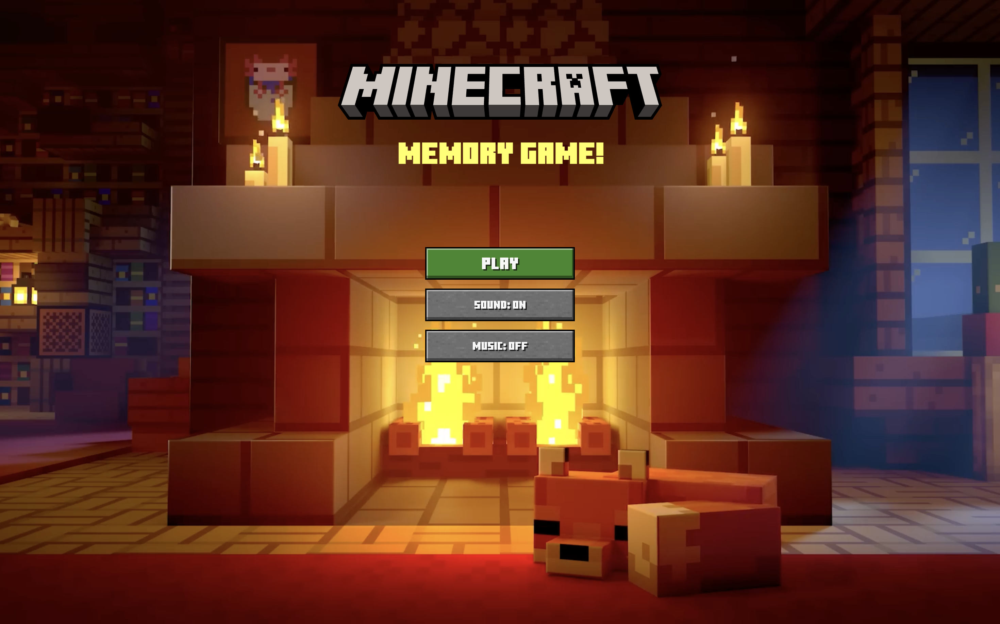
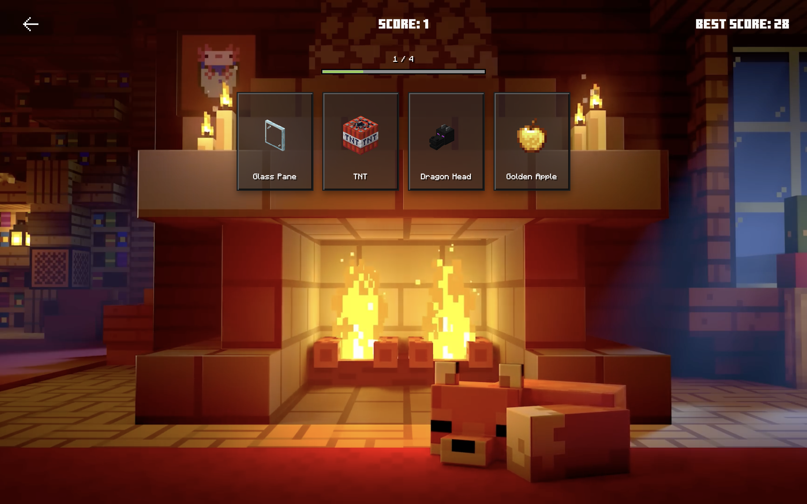

# Minecraft Memory Game
 
A memory card game built with React, themed around Minecraft.
 
🔗 [Live Demo](https://minecraft-memory-rose.vercel.app/)

## Screenshots

### Home Screen

### Gameplay

## How to play

Click on a card to score a point, but don't pick the same card twice in a round. Complete the round to unlock the next one with more cards. Beat every round to win!

## Features

- Progressive rounds with an increasing number of cards
- Randomized card shuffling after every pick
- Current Score and Best Score tracking (Best Score saved with localStorage)
- Progress bar showing round completion
- Sound effects and background music, with on/off toggles
- Win/lose modal with restart and home option
- Fully responsive design

## Built with
 
- React
- Vite
 